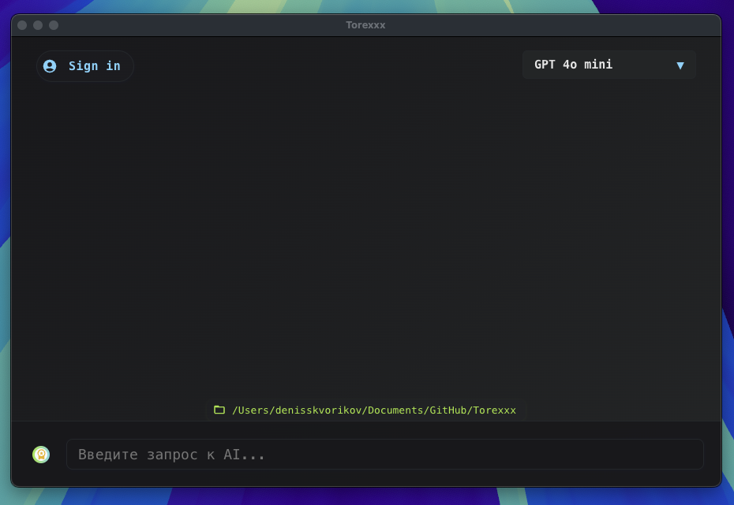

# Torexxx AI Terminal

> **AI-ассистент нового поколения для терминала. Мощь нейросетей, премиум-UI и мгновенное выполнение команд — всё в одном приложении для Mac, Windows и Linux.**

---

<p align="center">
  
</p>

<p align="center">
  
</p>

---

## 🚀 Почему Torexxx?

- **AI-терминал**: Получайте готовые команды для любых задач — быстро, безопасно, без лишних слов.
- **Премиум-модели**: Используйте лучшие нейросети (GPT-4o, QWEN, LLAMA, GEMINI и др.)
- **Мгновенное выполнение**: Запускайте команды одним кликом с подтверждением и контролем.
- **Современный UI**: Минимализм, анимации, адаптивность, премиум-иконки.
- **Безопасность**: AI предупреждает об опасных командах, ничего не выполнится без вашего согласия.
- **Кроссплатформенность**: Mac, Windows, Linux — всё поддерживается из коробки.
- **Лёгкий старт**: Не нужно быть программистом — просто скачайте и начните пользоваться.

---

## ⚡ Как начать?

**1. Скачайте приложение для вашей платформы:**

- **MacOS:**
  ```sh
  curl -L https://torexxx.com/download/latest-mac.dmg -o Torexxx.dmg
  open Torexxx.dmg
  ```
- **Windows:**
  ```powershell
  Invoke-WebRequest -Uri "https://torexxx.com/download/latest-win.exe" -OutFile "Torexxx-Setup.exe"
  Start-Process Torexxx-Setup.exe
  ```
- **Linux:**
  ```sh
  wget https://torexxx.com/download/latest-linux.AppImage -O Torexxx.AppImage
  chmod +x Torexxx.AppImage
  ./Torexxx.AppImage
  ```

**2. Запустите Torexxx и наслаждайтесь новым уровнем продуктивности!**

---

## 🏆 Для кого это?

- Разработчики, DevOps, инженеры, аналитики, все, кто работает с терминалом и ценит своё время.
- Для тех, кто хочет использовать AI для автоматизации и ускорения рутины.
- Для компаний, которым важны безопасность, контроль и премиум-качество.

---

## 🖼️ Вдохновляющий интерфейс

- Минималистичный дизайн, премиум-иконки, плавные анимации.
- Всё, что нужно — всегда под рукой.

---

## 🛡️ Безопасность и контроль

- AI никогда не выполнит опасную команду без вашего подтверждения.
- Вся история команд — только на вашем устройстве.
- Прозрачность и приватность на первом месте.

---

## 📬 Связаться с нами

- Telegram: [@JustFW](https://t.me/Torexxx)
- GitHub: [SkvorikovCode](https://github.com/SkvorikovCode)

---

> **Скриншоты и анимации:**
> - Поместите свои файлы `screenshot.png` и `demo.gif` в папку `docs/` для отображения в README.
> - Или замените ссылки на свои изображения.

---

**Torexxx — ваш AI-ассистент для терминала. Быстрее. Умнее. Безопаснее.**
